# Design System Documentation

## Architecture

## Components

Client apps(Web,...) : 
- Handle playback, navigation,...

Api Gateway : 
- The central entry point for all client requests. It routes requests to the appropriate backend services and handles authentication, rate limiting, and logging.

Auth Service :
- Manages user authentication and authorization. It handles login, registration, password management, and token generation.

Microservices :
The business logic is split into modular services:

- **User Service**: Manages user profiles, preferences, and settings.

- **Artist Service**:
  - Save/Edit/Delete (Hide) artist information
  - Follow artists
  - Like artists
  - View artist page: Artist info + Top tracks + Albums

- **Album Service**:
  - Get album list by artist
  - Get album information
  - Save albums to library

- **Song Service**:
  - CRUD songs
  - Metadata: song name, duration, artist
  - Get songs by album
  - Get songs by artist
  - Streaming data layer
  - Recent listening history

- **Playlist Service**:
  - Create/Edit/Delete playlists
  - Add songs to playlist
  - Remove songs from playlist

- **Library Service**:
  - Like songs
  - Like albums
  - Save playlists
  - Save recent songs
  - Resume playlist
  - Save listening history

- **Search Service**:
  - Search by keywords
  - Keyword suggestions
  - Search artists, songs, albums, playlists
  - Search logs + ranking
  - Full-text search

- **Stream Service**:
  - Stream music with range request
  - Count plays
  - Resume playback
  - Streaming throttling 

CDN : 
- Deliver static content and media files to users with low latency and high availability.

